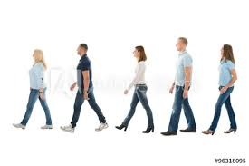
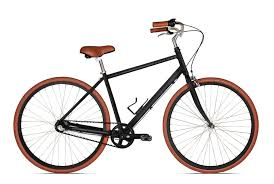
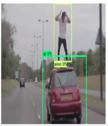
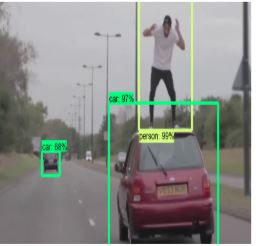
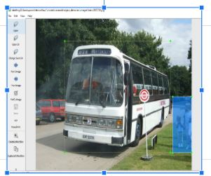
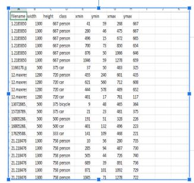
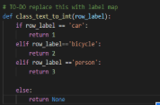
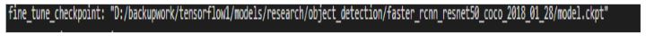

# deeplearning

# Tensorflow Object Detection for 3 Things:

            Car

   

  

        
        
          Person

  

         Bicycle

  

 # Main reference:

https://medium.com/object-detection-using-tensorflow-and-coco-pre/object-detection-using-tensorflow-and-coco-pre-trained-models-5d8386019a8

# reference code: for training and testing the model
https://github.com/tensorflow/models/blob/master/research/object_detection

## File videopretrained.py and imagepretrained.py is for testing the sample images and video using pretrained model

# Libraries needed to install:

tensorflow==1.4.0

opencv-python

keras==2.0.0

# environment needed to train:
            anaconda 3.5.0
https://www.anaconda.com/distribution/

# For labeliing each image by class you need:

[LabelImg GitHub link](https://github.com/tzutalin/labelImg)

The video will  abit slow to detect due to using fasterrcnn resnet model if run on local computer not cloud

# First Model and Second  Refer to:

https://1drv.ms/u/s!AjtR5zyBlsc9jxNXSR0e0kfWMUsa?e=c2oZdD

                                                           
                

# PreTrained Refer to:

faster_rcnn_resnet50_coco

https://github.com/tensorflow/models/blob/master/research/object_detection/g3doc/detection_model_zoo.md

   
   
   
   
   
   
 #                               Steps for Training the model
 
 
 
 
   # 1.Gathering data
                                
   https://www.kaggle.com/sanikamal/horses-or-humans-dataset
                        
   
   https://www.kaggle.com/tongpython/cat-and-dog
                                
                                
  #  2.Labeling data
[LabelImg GitHub link](https://github.com/tzutalin/labelImg)
               
 step a: run labelimg.py then label the images according to 3 classes mentioned
     
   

  

  

  

  
</p
  
  
                   
                   
                   
                                
        
  # 5.Training Model
                                
                             
                             
                             
                                
   # 6.Exporting inference graph
   
   
   
   
   
   # 7.Testing the object detector

