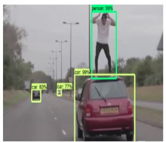

#                     Deeplearning Term-Project

#    This project is about using resnet-50(Residual Neural Network) as a  feature extractor   with the help of tensorflow to help in detecting specific objects using transfer learning techniques

##                   Resnet-50
                 The ResNet-50 model consists of 5 stages each with a convolution and Identity
             block. Each convolution block has 3 convolution layers and each identity block
             ResNet-50 is a convolutional neural network that is trained on more than a million images from the ImageNet database . The network is 50 layers deep and can classify images into 1000 object categories, such as keyboard, mouse, pencil, and many animals. As a result, the network has learned rich feature representations for a wide range of images. The network has an image input size of 224-by-224.
   

  

  

        
        
          Person

  

         Bicycle

  

 # Main reference for steps how to do:

 [Steps](https://github.com/navin20/deeplearning#Steps-for-Training-the-model)

# Main reference code: for training and testing the model
[Code](https://github.com/navin20/deeplearning#)

## File videopretrained.py and imagepretrained.py is for testing the sample images and video using pretrained model

# Libraries needed to install:

tensorflow==1.4.0

opencv-python

keras==2.0.0

# environment needed to train:
            anaconda 3.5.0
https://www.anaconda.com/distribution/

# For labeliing each image by class you need:

[LabelImg GitHub link](https://github.com/tzutalin/labelImg)

The video will  abit slow to detect due to using fasterrcnn resnet model if run on local computer not cloud

# First Model and Second  Refer to:

https://1drv.ms/u/s!AjtR5zyBlsc9jxNXSR0e0kfWMUsa?e=c2oZdD

                                                           
                

# PreTrained Refer to:

faster_rcnn_resnet50_coco

https://github.com/tensorflow/models/blob/master/research/object_detection/g3doc/detection_model_zoo.md

   
   
   
   
   
   
 #                               Steps for Training the model
 
 
 
 
   # 1.Gathering data
   # data is not really from any high source or website with datasets it is random images from many searching websites
                                
  [datasets](https://github.com/navin20/Deep-Learning-Term-Project/tree/master/datasets)
                                
  #  2.Labeling data
[LabelImg GitHub link](https://github.com/tzutalin/labelImg)
               
 step a: run labelimg.py then label the images according to 3 classes mentioned
     
   

  

  

  

  

  

  

  

  

  

  
</p                       
  
  
       
       
#      
       
       
# Other References

##            API:
## https://github.com/tensorflow/models/tree/master/research/object_detection

## How to use Transfer Learning

## https://machinelearningmastery.com/transfer-learning-for-deep-learning

 

